# Hotel Management System - Use Case Diagram

Based on the Prisma schema analysis, here's a comprehensive use case diagram for the hotel management system:

```mermaid
graph TB
    %% Actors
    Guest[👤 Guest]
    Staff[👨‍💼 Staff]
    Admin[👑 Admin]
    System[🖥️ System]
    
    %% Authentication & User Management
    subgraph "Authentication & User Management"
        UC1[Register Account]
        UC2[Login/Logout]
        UC3[Refresh Token]
        UC4[Password Reset]
        UC5[Email Verification]
        UC6[Manage User Profile]
        UC7[View User Statistics]
    end
    
    %% Room Management
    subgraph "Room Management"
        UC8[View Available Rooms]
        UC9[Search Rooms by Filters]
        UC10[View Room Details]
        UC11[Create Room]
        UC12[Update Room]
        UC13[Delete Room]
        UC14[Update Room Status]
        UC15[View Room Statistics]
    end
    
    %% Booking Management
    subgraph "Booking Management"
        UC16[Create Booking]
        UC17[View My Bookings]
        UC18[View All Bookings]
        UC19[Update Booking]
        UC20[Cancel Booking]
        UC21[Delete Booking]
        UC22[Check Room Availability]
        UC23[View Booking Statistics]
    end
    
    %% Payment Management
    subgraph "Payment Management"
        UC24[Process Payment]
        UC25[View Payment History]
        UC26[Refund Payment]
        UC27[Update Payment Status]
        UC28[View Payment Statistics]
    end
    
    %% Stay Record Management
    subgraph "Stay Record Management"
        UC29[Create Stay Record]
        UC30[Check-in Guest]
        UC31[Check-out Guest]
        UC32[Update Stay Record]
        UC33[View Stay Records]
        UC34[Add Additional Charges]
        UC35[View Stay Statistics]
    end
    
    %% System Operations
    subgraph "System Operations"
        UC36[Generate Reports]
        UC37[Manage System Settings]
        UC38[Audit Trail]
        UC39[Data Backup]
        UC40[System Monitoring]
    end
    
    %% Guest Use Cases
    Guest --> UC1
    Guest --> UC2
    Guest --> UC3
    Guest --> UC4
    Guest --> UC5
    Guest --> UC6
    Guest --> UC8
    Guest --> UC9
    Guest --> UC10
    Guest --> UC16
    Guest --> UC17
    Guest --> UC20
    Guest --> UC24
    Guest --> UC25
    Guest --> UC30
    Guest --> UC31
    Guest --> UC33
    
    %% Staff Use Cases
    Staff --> UC1
    Staff --> UC2
    Staff --> UC3
    Staff --> UC4
    Staff --> UC5
    Staff --> UC6
    Staff --> UC8
    Staff --> UC9
    Staff --> UC10
    Staff --> UC14
    Staff --> UC16
    Staff --> UC17
    Staff --> UC18
    Staff --> UC19
    Staff --> UC20
    Staff --> UC21
    Staff --> UC22
    Staff --> UC24
    Staff --> UC25
    Staff --> UC26
    Staff --> UC27
    Staff --> UC29
    Staff --> UC30
    Staff --> UC31
    Staff --> UC32
    Staff --> UC33
    Staff --> UC34
    Staff --> UC35
    
    %% Admin Use Cases
    Admin --> UC1
    Admin --> UC2
    Admin --> UC3
    Admin --> UC4
    Admin --> UC5
    Admin --> UC6
    Admin --> UC7
    Admin --> UC8
    Admin --> UC9
    Admin --> UC10
    Admin --> UC11
    Admin --> UC12
    Admin --> UC13
    Admin --> UC14
    Admin --> UC15
    Admin --> UC16
    Admin --> UC17
    Admin --> UC18
    Admin --> UC19
    Admin --> UC20
    Admin --> UC21
    Admin --> UC22
    Admin --> UC23
    Admin --> UC24
    Admin --> UC25
    Admin --> UC26
    Admin --> UC27
    Admin --> UC28
    Admin --> UC29
    Admin --> UC30
    Admin --> UC31
    Admin --> UC32
    Admin --> UC33
    Admin --> UC34
    Admin --> UC35
    Admin --> UC36
    Admin --> UC37
    Admin --> UC38
    Admin --> UC39
    Admin --> UC40
    
    %% System Use Cases
    System --> UC3
    System --> UC4
    System --> UC5
    System --> UC14
    System --> UC22
    System --> UC27
    System --> UC30
    System --> UC31
    System --> UC38
    System --> UC39
    System --> UC40
    
    %% Styling
    classDef guestStyle fill:#e1f5fe,stroke:#01579b,stroke-width:2px
    classDef staffStyle fill:#f3e5f5,stroke:#4a148c,stroke-width:2px
    classDef adminStyle fill:#fff3e0,stroke:#e65100,stroke-width:2px
    classDef systemStyle fill:#e8f5e8,stroke:#2e7d32,stroke-width:2px
    
    class Guest guestStyle
    class Staff staffStyle
    class Admin adminStyle
    class System systemStyle
```

## Use Case Descriptions

### Authentication & User Management
- **UC1: Register Account** - Users can register with email, password, and role-specific information
- **UC2: Login/Logout** - Secure authentication with JWT tokens
- **UC3: Refresh Token** - Automatic token refresh for seamless user experience
- **UC4: Password Reset** - Secure password reset via email tokens
- **UC5: Email Verification** - Email verification for account activation
- **UC6: Manage User Profile** - Update personal information and preferences
- **UC7: View User Statistics** - Admin-only user analytics and reporting

### Room Management
- **UC8: View Available Rooms** - Public access to room listings
- **UC9: Search Rooms by Filters** - Filter by type, capacity, price, status, floor
- **UC10: View Room Details** - Detailed room information and amenities
- **UC11: Create Room** - Admin-only room creation
- **UC12: Update Room** - Admin-only room updates
- **UC13: Delete Room** - Admin-only room deletion
- **UC14: Update Room Status** - Staff/Admin room status management
- **UC15: View Room Statistics** - Admin-only room analytics

### Booking Management
- **UC16: Create Booking** - Guests and staff can create bookings
- **UC17: View My Bookings** - Users can view their own bookings
- **UC18: View All Bookings** - Staff/Admin can view all bookings
- **UC19: Update Booking** - Staff/Admin can modify bookings
- **UC20: Cancel Booking** - Users can cancel their bookings
- **UC21: Delete Booking** - Staff/Admin can delete bookings
- **UC22: Check Room Availability** - Real-time availability checking
- **UC23: View Booking Statistics** - Admin-only booking analytics

### Payment Management
- **UC24: Process Payment** - Handle various payment methods
- **UC25: View Payment History** - Track payment transactions
- **UC26: Refund Payment** - Process refunds for cancelled bookings
- **UC27: Update Payment Status** - Staff/Admin payment status management
- **UC28: View Payment Statistics** - Admin-only payment analytics

### Stay Record Management
- **UC29: Create Stay Record** - Staff/Admin create stay records
- **UC30: Check-in Guest** - Staff process guest check-ins
- **UC31: Check-out Guest** - Staff process guest check-outs
- **UC32: Update Stay Record** - Staff/Admin modify stay records
- **UC33: View Stay Records** - Staff/Admin view stay information
- **UC34: Add Additional Charges** - Staff add extra charges during stay
- **UC35: View Stay Statistics** - Admin-only stay analytics

### System Operations
- **UC36: Generate Reports** - Admin-only comprehensive reporting
- **UC37: Manage System Settings** - Admin-only system configuration
- **UC38: Audit Trail** - System tracks all user actions
- **UC39: Data Backup** - System automated data backup
- **UC40: System Monitoring** - System health and performance monitoring

## Key Features Highlighted

1. **Role-Based Access Control**: Different access levels for Guest, Staff, and Admin
2. **Comprehensive Booking Flow**: From room search to checkout
3. **Payment Integration**: Multiple payment methods and status tracking
4. **Stay Management**: Complete guest stay lifecycle
5. **Security Features**: JWT tokens, password reset, email verification
6. **Analytics & Reporting**: Statistics and reporting for all major entities
7. **System Administration**: Complete admin control over all operations

This use case diagram represents the complete functionality of your hotel management system based on the Prisma schema and implemented APIs.
